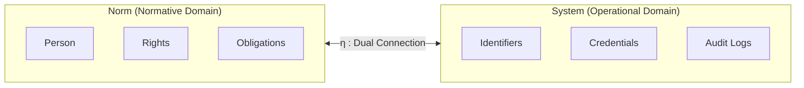
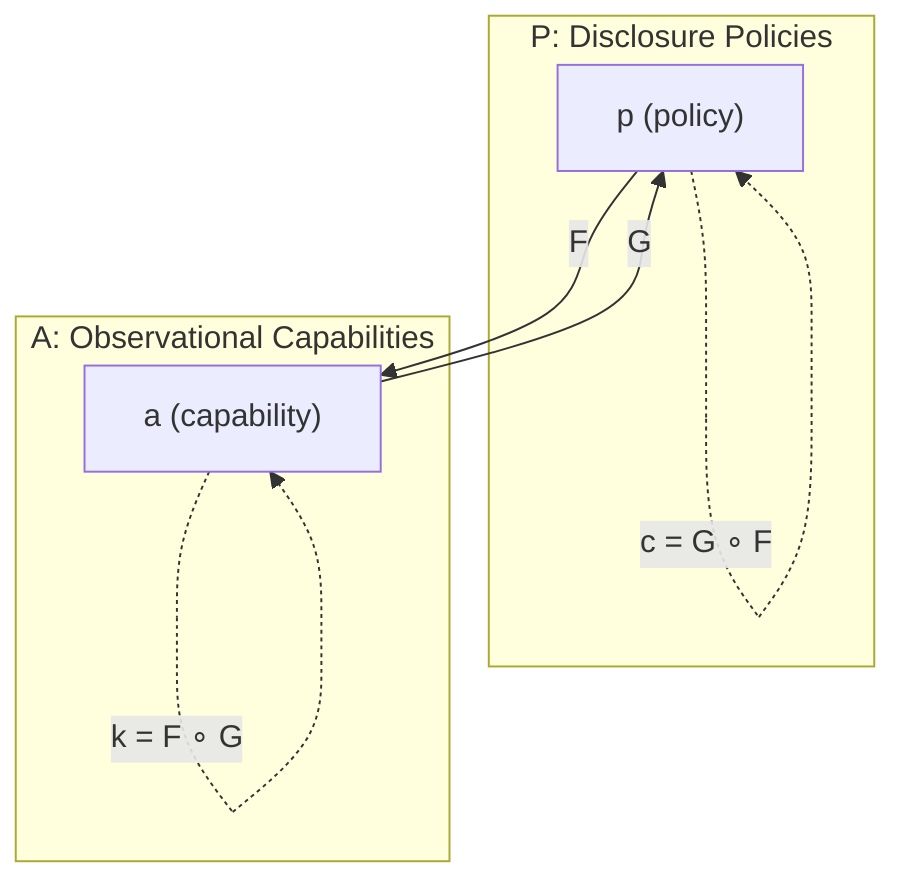
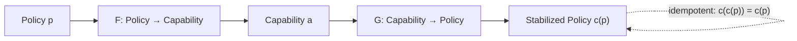
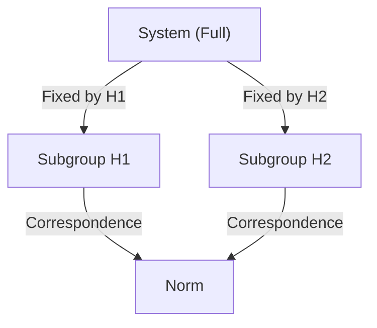
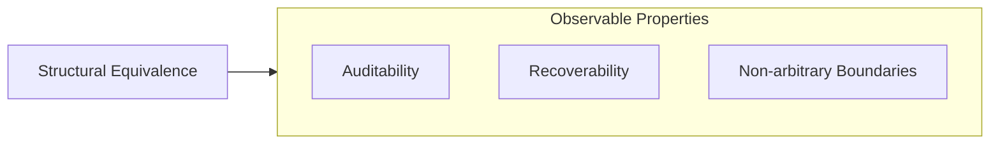
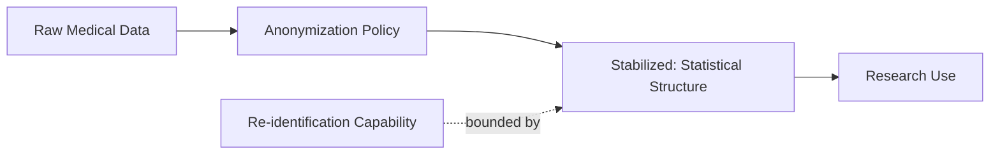
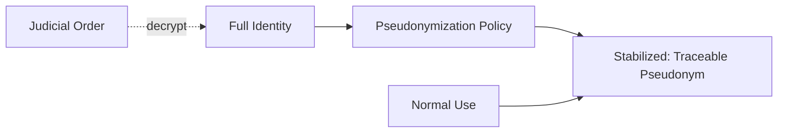
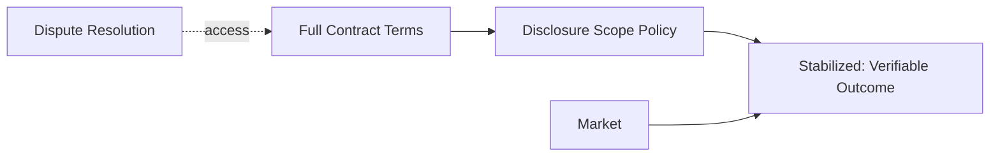
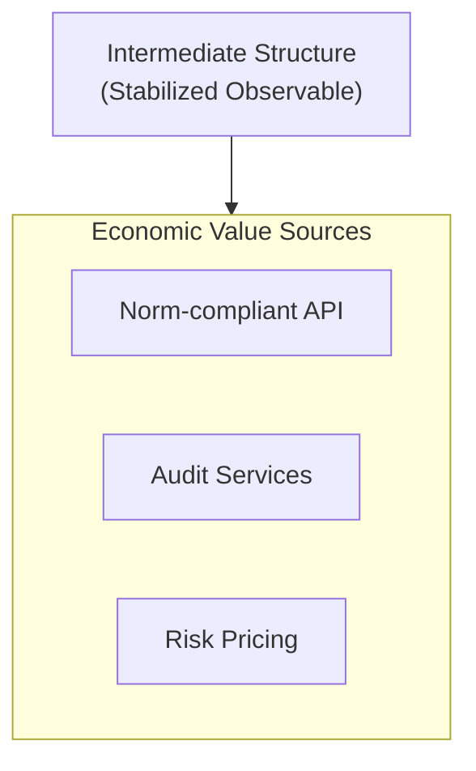
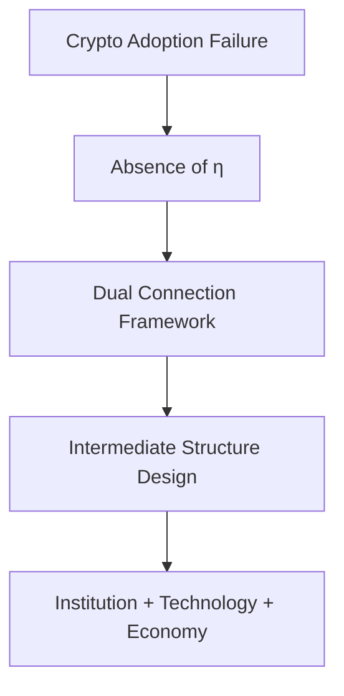

# accountability-by-construction

## Norm ⇒ System Duality: A Formal Report

> Political position statement through formal structure
> This document intentionally avoids ideology, analogy, and metaphor,
> and instead presents a minimal mathematical structure for public systems.

---

## 0. Executive Summary

This repository presents a formal framework describing the relationship between:

- **Norm**: rules, rights, obligations, and justifications
- **System**: implementations, procedures, and observable operations

The core claim is that their relationship is **not a one-way translation**, but a
**dual constraint structure**, formalized using order-theoretic duality.

No historical mathematical theory names are required to understand or apply this framework.

---

## 1. Norm (Normative Domain)

### Objects
Units that can demand justification.

- Person
- Data subject
- Right bundle
- Obligation bundle
- Institutional procedure

### Morphisms
Justification-preserving transformations.

- consent
- revocation
- mandate
- audit request
- remedy request

---

## 2. System (Operational Domain)

### Objects
Operational entities.

- Identifiers
- Credentials
- Encrypted data
- Access policies
- Audit logs
- Recovery procedures

### Morphisms
Executable operations.

- grant / revoke
- encrypt / decrypt
- sign / verify
- log / audit
- recover

---

## 3. Dual Constraint Structure

Let:

- **P** be a partially ordered set of disclosure policies
- **A** be a partially ordered set of observational capabilities

with order representing *strength*.

Define monotone maps:

- F : P → A
- G : A → P

such that:

    F(p) ≤ a  ⇔  p ≤ G(a)

This structure is called a **dual connection**.

---

## 4. Stabilization Operator

Define:

- c = G ∘ F

Then c is an **idempotent, monotone stabilization operator**.

Interpretation:
> c(p) is the maximum disclosure condition that remains normatively acceptable.

This operator represents the concrete decision process for η.

---

## 5. η Determination = Selection of Stabilization Operator

The determination of η is formulated as:
- Fix a substructure H ⊂ G
- L^H represents "permissible System observations"

---

## 6. Observability and Structure Preservation

Only properties preserved under admissible structural equivalences
are considered observable.

This ensures:

- auditability
- recoverability
- non-arbitrary disclosure boundaries

---

## 7. Applied Examples (Illustrative)

### Medical Data
- Policy order: anonymization strength
- Capability order: re-identification power

Stabilization yields conditionally usable datasets.

### Administrative Identity
- Policy order: pseudonymity vs traceability
- Capability order: authority of inspection

Stabilization yields traceable-but-non-identifying identifiers.

### Contracts
- Policy order: disclosure scope
- Capability order: dispute resolution power

Stabilization yields verifiable outcomes without revealing full terms.

---

## 8. Economic Interpretation

- Stabilization cost corresponds to operational and legal risk
- Smaller observable sets reduce exposure but increase friction
- Verification becomes a measurable service

### Value Generation Points

| Category | Examples |
|----------|----------|
| Intermediate Structure Monetization | Norm-compliant API, Conditional disclosure design |
| η Verification Business | Audit, Certification, Insurance |
| Risk Quantification | Pricing of structural breach, Usage fees, Deposits, Premiums |

---

## 9. Conclusion

This framework does not advocate transparency or secrecy.

It asserts:

> Trust is not a moral property.
> Trust is a structural consequence.

### Summary

- The failure of cryptographic adoption is not technical—it is the absence of η
- η can be organized as "fixing structural equivalences" through dual connection
- The design of intermediate structures is the core that connects institution, technology, and economy

---

## 日本語版 / Japanese Version

### 概要

本フレームワークは暗号技術普及のボトルネックを以下のように捉える：

- **規範の圏 Norm**: 権利・義務・正当化を要求できる単位
- **実装の圏 System**: 実行可能な操作・手続き

両者の関係は**一方向の翻訳ではなく、双対的制約構造**である。

### 核心的主張

- η の決定は「どの構造的同値（権限）を固定するか」という設計問題
- その結果生じる**中間体（部分公開・条件付き公開）**が経済的価値・インセンティブの源泉

### 例示

| 領域 | 固定条件 | 中間体 |
|------|----------|--------|
| 医療データ | 研究者は匿名統計のみ | 個人性を失った統計構造 |
| 行政ID | 通常は仮名、司法命令で復号 | 行為追跡可能・人格不可視 |
| 契約・署名 | 市場には履行結果のみ | 信用のみ可視 |

### 結論

> 信頼は道徳的属性ではない。
> 信頼は構造的帰結である。
